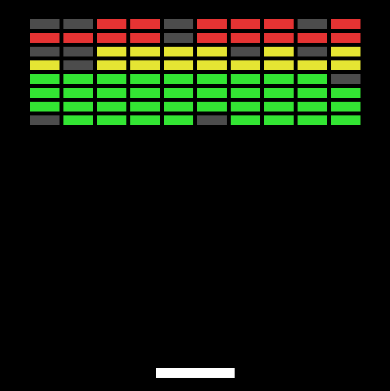
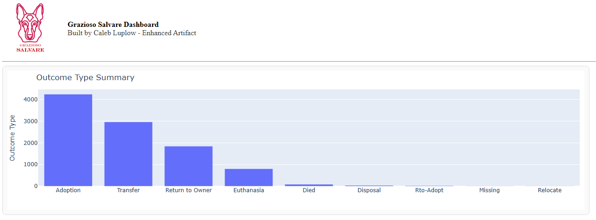

<h1 class="center-text">CS-499 Computer Science Capstone</h1>



Welcome to my CS-499 capstone ePortfolio. This site showcases my growth throughout the Computer Science Program through code review, artifact enhancement, and reflective analysis. It also highlights my ability to evaluate existing software, improve system design, and communicate technical decisions in a profressional context.

---

## Self-Assessment

Starting this program has been an eye-opening journey. My interest in computer science started at a young age during a time when technology was not quite mainstream. It has always been fueled by curiosity and a desire to understand why things work the way they do. I did not begin my formal education in computer science until 2011 while I was enlisted in the Marine Corps. Unfortunately, I had to take a hiatus from my studies to prioritize the care of my family. As circumstances changed, I made the decision to continue forward and finish what I started, returning in 2023 to complete my bachelor's degree in computer science. Since then, I have remained consistent and committed to that goal.

Over the course of this program, I have worked to build a strong foundation in computer science while balancing a full-time career and a demanding schedule. What started as a decision to finish my degree has evolved into a clear transition towards a career in software engineering. This ePortfolio represents that progression and serves as both a reflection of my growth and a demonstration of the skills I have developed along the way. It highlights my ability to design and improve software systems, apply structured problem-solving techniques, and work across multiple areas of computer science, including software engineering, algorithms, databases, and security.

As I moved through the program, my approach to development changed significantly. Early on, my focus was simply on getting things to work. Over time, that shifted toward understanding how systems should be designed, structured, and maintained in a real-world environment. I gained hands-on experience working with full-stack applications, RESTful APIs, and database-driven systems, while also developing a stronger understanding of object-oriented design and system architecture. More importantly, I began thinking beyond individual features and considering how different parts of a system interact, how decisions impact long-term maintainability, and how to build solutions that are scalable and reliable.

Throughout the program, I also developed a stronger understanding of collaboration and communication in a technical environment. In projects such as DriverPass from CS-255, I worked with system requirements and stakeholder expectations, which required me to think from both a technical and non-technical perspective. This helped me learn how to communicate effectively with individuals who may not have a technical background. I also came to understand that communication extends beyond conversation. Writing clean, readable code, organizing projects logically, and documenting decisions are all critical components of working effectively in a team environment.

My understanding of data structures and algorithms has also improved, particularly in how I approach problem solving. Rather than relying on trial and error, I now focus on breaking problems down into smaller components, selecting appropriate data structures, and designing solutions that are both efficient and maintainable. I have learned that a good solution is not just one that works, but one that is structured in a way that others can understand and build upon. This shift in thinking has allowed me to approach more complex problems with greater confidence and clarity.

In addition, my experience with software engineering and databases has expanded beyond basic implementation. I have worked with technologies such as MongoDB, backend frameworks, and API-driven systems, which helped me understand how data flows through an application and how different components interact. I also explored more advanced database concepts such as aggregation, indexing, and performance considerations, reinforcing the importance of designing systems that can handle real-world data efficiently.

Security has become an important part of how I approach development. Instead of focusing only on functionality, I began considering how systems could be misused or exploited. This led to implementing practices such as authentication, input validation, and environment-based configuration to protect sensitive data. These decisions reflect a broader shift toward building systems that are not only functional, but also secure and reliable.

The artifacts included in this portfolio were intentionally selected to demonstrate my growth across software engineering and design, algorithms and data structures, and databases. Each one focuses on a different area, but they are all connected through a consistent emphasis on improving structure, solving problems effectively, and applying concepts in a way that mirrors real-world development. Together, they demonstrate my ability to analyze existing systems, identify areas for improvement, and implement meaningful enhancements that improve both functionality and maintainability.

As I complete this program, I am focused on transitioning into a software engineering role where I can continue to grow and apply these skills in a professional setting. My drive for growth is not just fueled by success, but by understanding why something works rather than simply how it works. This ePortfolio represents both where I started and how far I have come, and it serves as a strong foundation for my continued curiosity and the next phase of my career.

---

## Code Review

This code review serves as the foundation for my capstone enhancements and overall improvement strategy. In this walkthrough, I review the existing functionality of my selected artifacts, identify areas for improvement, and explain the enhancements I planned across software design and engineering, algorithms and data structures, and databases.

The purpose of this review was not only to inspect the code, but to also demonstrate my ability to analyze software critically, communicate technical ideas clearly, and establish a roadmap for meaningful improvement.

  <iframe
    src="https://www.youtube.com/embed/o9GIhXgXjqo"
    frameborder="0"
    allowfullscreen
    style="position: absolute; top:0; left:0; width:100%; height:100%;">
  </iframe>

[Watch the Code Review on YouTube](https://youtu.be/o9GIhXgXjqo)

---

## Featured Work

### Software Engineering and Design
  

  [Artifact 1 - Travlr Full-Stack Application](artifact1/)
  
  Enhanced a MEAN-based travel application with stronger architecture, request validation, and improved separation of concerns.

  **Focus:** full-stack development, API design, maintainability, security

### Algorithms and Data Structures
  

  [Artifact 2 - C++ Brick Grid Generation System](artifact2/)

  Redesigned grid generation logic to improve structure, control, and long-term maintainability while using data structures more intentionally.

  **Focus:** algorithm design, data modeling, problem solving

### Databases
  

  [Artifact 3 - MongoDB Dashboard and CRUD Enhancement](artifact3/)

  Expanded a Python and MongoDB project with stronger configuration practices, improved data handling, and more advanced query capabilities.

  **Focus:** databases, aggregation, indexing, backend data flow
